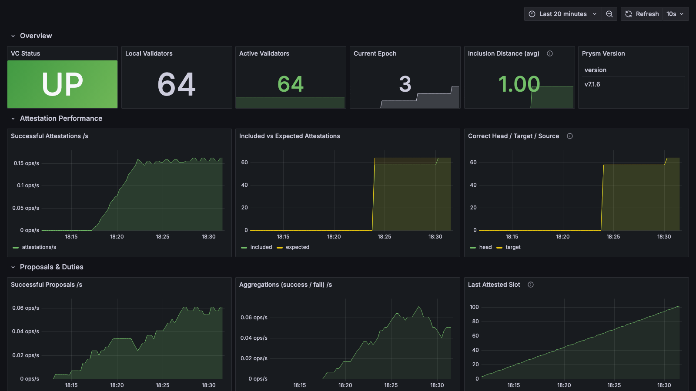
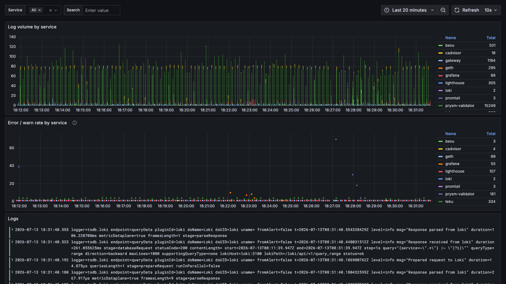
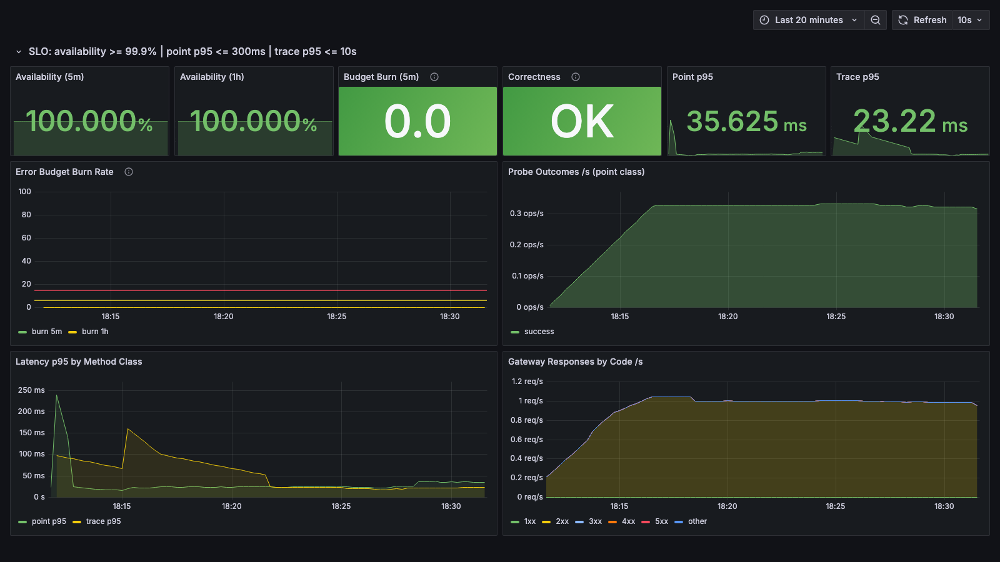
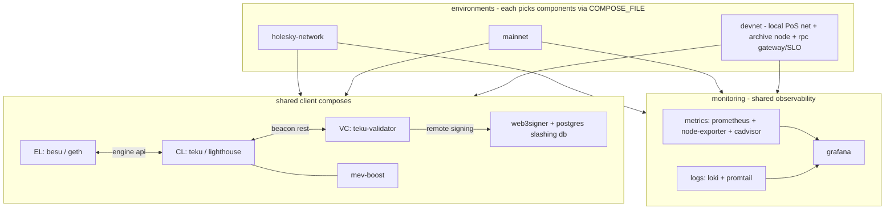

# eth-docker-practice

A local Ethereum PoS network with an archive node, four-layer observability
and an implemented SLO. Built from reusable per-client compose files that
also run against holesky and mainnet (last section).

## Local PoS network + archive node (devnet/)

A self-contained network for testing operations against a chain you fully
control - no checkpoint sync, no public testnet, blocks in seconds. Two
client-diverse pairs:

```
validating pair                       archive pair
+------------------+                  +-------------------+
| besu (EL)  :8545 |  <-- EL p2p -->  | geth (EL)  :8547  |
| teku (CL)  :5051 |  <-- CL p2p -->  | lighthouse (CL)   |
| prysm vc, 64 val |                  |  --gcmode=archive |
+------------------+                  +---------+---------+
  produces blocks                               |
                                      gateway (haproxy) :8548
                                      point pool | heavy pool
                                                ^
                                      prober: SLIs -> prometheus

observability (shared): prometheus + node-exporter + cadvisor + loki/promtail
                        -> grafana :3001 (10 dashboards, 19 alerts)
```

The validating pair produces blocks; the archive pair follows and keeps all
historical state. Archive queries are served through the gateway on 8548
(raw node RPC stays on 8547 for debugging). Client diversity across the
pairs is deliberate: a consensus bug in one client cannot take out both.

The full stack is ~18 containers; plan for **8GB RAM and 4+ cores**.

### Run

One command (macOS / Ubuntu; needs docker with compose v2, curl, python3):

```bash
git clone https://github.com/terrydevops/eth-docker-practice.git
cd eth-docker-practice/devnet
./scripts/quickstart.sh
```

It checks prerequisites, generates identities (local node, or a docker
container if node is not installed), runs the genesis ceremony, starts the
stack, waits for blocks, sends traffic and runs the verification suite.
About 5 minutes. `./scripts/quickstart.sh clean` tears everything down.

The same steps individually:

```bash
make setup     # node identities, jwt secrets, .env (generated, not committed)
make genesis   # one-time genesis ceremony (refuses to rerun)
make up        # start both pairs
make status    # heads of both ELs + consensus slot
make traffic   # send transfers so historical state differs across heights
make verify    # prove the archive property
make test-rpc  # acceptance test of the JSON-RPC surface, through the gateway
make clean     # full reset
```

Blocks start ~90s after genesis.

### Inspect archive queries

`make verify` asserts what makes this an archive node rather than a pruned
one:

1. archive head follows the validating head
2. `eth_getBalance(account, height)` succeeds at any past height (a pruned
   node returns `missing trie node` beyond its horizon); after `make traffic`
   the balances differ across heights - real point-in-time state
3. `debug_traceBlockByNumber` works on old blocks
4. the geth container runs `--gcmode=archive --state.scheme=hash --syncmode=full --history.transactions=0`

Manual check (the funded account's balance drops as it spends):

```bash
for b in 0x1 0x58 0x5e; do
  curl -s -X POST -H 'content-type: application/json' \
    -d "{\"jsonrpc\":\"2.0\",\"method\":\"eth_getBalance\",\"params\":[\"0x123463a4B065722E99115D6c222f267d9cABb524\",\"$b\"],\"id\":1}" \
    http://localhost:8547
done
```

`make test-rpc` runs 13 acceptance checks of the JSON-RPC surface through
the gateway: historical state, transaction index, logs, traces, batch
requests, error semantics.

### Monitoring

Four layers, so a problem can be traced from the host down to a single log
line:

| layer | collector | what |
|---|---|---|
| chain | Prometheus | besu, teku, geth, lighthouse, prysm-validator + archive alerts |
| machine | node-exporter | host cpu, memory, disk, filesystem, network |
| container | cAdvisor | per-container cpu / memory / network |
| logs | Loki + Promtail | every container's stdout/stderr, searchable in Grafana |

- Grafana: http://localhost:3001 (anonymous viewer). Folders: **Clients**
  (official Besu/Geth/Teku/Lighthouse dashboards), **Devnet** (archive +
  validator), **Machine**, **Containers**, **Logs**.
- Prometheus: http://localhost:9091
- Loki has no host port; Grafana reads it over the internal network.
  Promtail is scoped to this stack's network, so it does not ingest
  unrelated containers on a shared host.


*64 validators attesting and proposing; inclusion distance 1.0.*


*Log volume and error/warn rate per service, with a searchable live tail.*

### Archive RPC gateway and SLO

Archive queries go through haproxy on **8548** - the SLO is defined and
measured at the gateway, not at the node:

- `debug_`/`trace_` calls route to a separate pool with a strict concurrency
  cap, so one pathological trace cannot starve point reads.
- The health check is a JSON-RPC call, not a tcp probe: a node that accepts
  connections but cannot answer is ejected.
- A synthetic prober sends point reads and traces at random historical
  heights and runs two correctness checks: cross-client block-hash diff
  (geth vs besu) and the genesis balance invariant, which only an archive
  node can serve.
- SLO as code (`monitoring/metrics/prometheus/slo-rules.yml`): availability
  and error-budget burn as recording rules; multi-window multi-burn-rate
  alerts - fast burn (>14.4x on 5m and 1h) pages, slow burn tickets, p95
  breaches ticket, correctness divergence pages immediately.

Alerting keeps the same layer split, severity `page` = wake someone,
`ticket` = working hours:

| layer | alerts |
|---|---|
| machine | HostDiskWillFillSoon (projected full <7d, page), HostDiskSpaceLow (page), HostOutOfMemory, HostHighCpu |
| containers | ContainerOomKilled, ContainerMemoryNearLimit |
| chain | ArchiveNodeLagging (page), ArchiveNodeDown (page), NodeDown (page), ChainStalled (page), AttestationsStalling (page), FinalityStalled |
| slo | RpcAvailabilityFastBurn (page), SlowBurn, point/trace p95 breach, RpcCorrectnessDivergence (page) |
| meta | SloMeasurementBlind (prober/gateway down = flying blind), CollectorDown |

Two drills, verified end to end: `docker compose stop geth` fires
ArchiveNodeDown, then RpcAvailabilityFastBurn within ~3 minutes;
`docker compose stop prysm-validator` fires ChainStalled ~2 minutes later
(nobody signs proposals). Both clear on restart.


*Availability against the 99.9% objective, burn rate, correctness probes,
p95 per method class.*

### Production archive-node operations

The production design - client selection, capacity, upgrades, backup,
monitoring, SLO/error budget/paging - is in
[devnet/docs/archive-node-operations.md](devnet/docs/archive-node-operations.md)
(2-3 pages). The devnet is the local harness that validates it.

### Devnet notes

- geth is pinned with `--state.scheme=hash`: recent geth defaults to path
  storage, which does not support archive mode.
- the validator client is prysm with built-in interop keys, for a
  zero-config devnet. The production validator stack (teku-validator +
  web3signer + slashing db) lives in the component directories.
- genesis is a one-time ceremony, not part of `make up`: regenerating it on
  restart would silently fork the chain.

## Repository layout

Client compose files live at the top level and are shared. Each environment
directory picks components via `COMPOSE_FILE` in its `.env` and holds that
network's config. All images are pinned.



| dir | what |
|---|---|
| besu/, geth/ | execution clients |
| teku/, lighthouse/ | consensus clients |
| teku-validator/ | validator client (signs via web3signer) |
| web3signer/ | remote signer + postgres slashing db |
| mev-boost/ | mev sidecar |
| devnet/ | the local network above |
| holesky-network/, mainnet/ | the same components against public networks |
| monitoring/ | metrics (prometheus + exporters), logs (loki + promtail), grafana |
| docs/ | day-2 runbook |

Design points:

- each component has its own compose project, .env and data dir; an EL
  upgrade never touches the VC. Components talk over one named bridge
  network.
- EL and CL both come in two flavours with the same interface, so pairs mix:
  besu+teku primary, geth+lighthouse standby.
- validator keys are not on the validator client: web3signer holds them,
  slashing protection lives in postgres, and db locking makes sure a key
  signs only once even with several web3signer instances.
- metrics on for every component, http allowlists closed by default.

## Origin: holesky and mainnet

The component composes predate the devnet - they ran besu+teku+
teku-validator+web3signer against holesky and mainnet, and the devnet was
built on top of them. To run against a public network:

```bash
# per component: copy env template and review
cd besu && cp .env.example .env && cd ..
cd teku && cp .env.example .env && cd ..

# one jwt secret per EL/CL pair
openssl rand -hex 32 | tr -d "\n" > jwtsecret.hex
cp jwtsecret.hex besu/data/ && cp jwtsecret.hex teku/data/

# EL first, then CL
(cd besu && docker compose up -d)
(cd teku && docker compose up -d)
```

Change the placeholder postgres credentials and set your own
`VALIDATORS_FEE_RECIPIENT` before starting anything. Jwt secrets and
keystores are gitignored; only templates are committed. Validator setup and
day-2 procedures (deposit keys, voluntary exit, slashing db migration):
[docs/runbook.md](docs/runbook.md).
