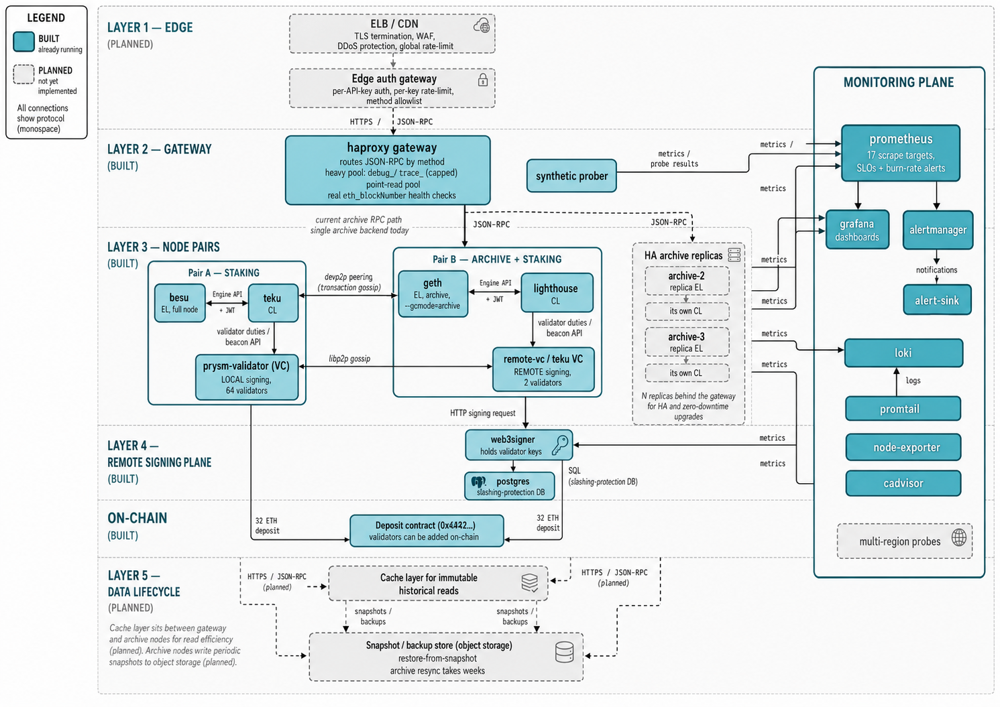

# eth-docker-practice

A local Ethereum PoS network with an archive node, live on-chain staking
through a remote signer, five-layer observability and three SLOs. Built from
reusable per-client compose files that also run against holesky and mainnet
(last section).

## Local PoS network + archive node (devnet/)

A self-contained network for testing operations against a chain you fully
control - no checkpoint sync, no public testnet, blocks in seconds. Two
client-diverse pairs, a remote-signing plane and a monitoring plane:


*Teal = built and running; dashed = the production design not yet
implemented (edge tier, HA replicas, snapshot recovery). The five layers,
top to bottom: edge, gateway, node pairs, remote signing, data lifecycle -
with the monitoring plane alongside.*

The validating pair produces blocks with 64 interop validators signing
locally. The archive pair both serves historical state and stakes: two
validators added on-chain through the predeployed deposit contract, their
keys held by web3signer and driven by a teku validator client in
remote-signing mode. So the two pairs also demonstrate the two key-custody
models side by side - local keys vs a remote signer with a slashing-
protection database.

Archive queries are served through the gateway on 8548 (raw node RPC stays on
8547 for debugging). Client diversity across the pairs is deliberate: a
consensus bug in one client cannot take out both, and each client gets alerts
tuned to its own runtime (JVM GC for besu/teku, goroutines for geth).

The full stack is ~20 containers; plan for **8GB RAM and 4+ cores**.

### Run

One command (macOS / Ubuntu; needs docker with compose v2, curl, python3):

```bash
git clone https://github.com/terrydevops/eth-docker-practice.git
cd eth-docker-practice/devnet
./scripts/quickstart.sh
```

It checks prerequisites, generates identities (local node, or a docker
container if node is not installed), runs the genesis ceremony, starts the
stack, waits for blocks, sends traffic and runs the verification suite.
About 5 minutes. `./scripts/quickstart.sh clean` tears everything down.

The same steps individually:

```bash
make setup     # node identities, jwt secrets, .env (generated, not committed)
make genesis   # one-time genesis ceremony (refuses to rerun)
make up        # start both pairs
make status    # heads of both ELs + consensus slot
make traffic   # send transfers so historical state differs across heights
make verify    # prove the archive property
make test-rpc  # acceptance test of the JSON-RPC surface, through the gateway
make clean     # full reset
```

Blocks start ~90s after genesis.

### Inspect archive queries

`make verify` asserts what makes this an archive node rather than a pruned
one:

1. archive head follows the validating head
2. `eth_getBalance(account, height)` succeeds at any past height (a pruned
   node returns `missing trie node` beyond its horizon); after `make traffic`
   the balances differ across heights - real point-in-time state
3. `debug_traceBlockByNumber` works on old blocks
4. the geth container runs `--gcmode=archive --state.scheme=hash --syncmode=full --history.transactions=0`

Manual check (the funded account's balance drops as it spends):

```bash
for b in 0x1 0x58 0x5e; do
  curl -s -X POST -H 'content-type: application/json' \
    -d "{\"jsonrpc\":\"2.0\",\"method\":\"eth_getBalance\",\"params\":[\"0x123463a4B065722E99115D6c222f267d9cABb524\",\"$b\"],\"id\":1}" \
    http://localhost:8547
done
```

`make test-rpc` runs 13 acceptance checks of the JSON-RPC surface through
the gateway: historical state, transaction index, logs, traces, batch
requests, error semantics.

### Monitoring

Five layers, so a problem can be traced from the host down to a single log
line - and the fifth layer is the monitoring watching itself:

| layer | collector | what |
|---|---|---|
| chain | Prometheus | besu, teku, geth, lighthouse, prysm-validator, remote-vc, web3signer |
| machine | node-exporter | host cpu, memory, disk, filesystem, network |
| container | cAdvisor | per-container cpu / memory / network |
| logs | Loki + Promtail | every container's stdout/stderr, searchable in Grafana |
| meta | Prometheus | prometheus, alertmanager, grafana, loki, promtail scrape themselves |

- Grafana: http://localhost:3001 (anonymous viewer; folders: Clients,
  Clients/Lighthouse, Devnet, Machine, Containers, Monitoring, Logs). ~30
  dashboards - the upstream client boards (Besu Full, Teku Detailed,
  sigp's lighthouse set, Node Exporter Full, cAdvisor) plus custom devnet
  boards: per-pair API surfaces, EL comparison, remote signing, lighthouse
  finality, and the SLO board.
- Prometheus: http://localhost:9091, alert states at /alerts.
- Alertmanager: http://localhost:9093 routes by severity - `page` notifies
  in 10s and repeats hourly, `ticket` batches for working hours - with
  inhibition so a down node's downstream symptoms stay quiet. Delivery lands
  in a local webhook sink (a real workspace is one config line away); the
  sink exports counters so the delivery path itself is alertable.
- Loki has no host port; Grafana reads it internally. Promtail is scoped to
  this stack's network, so it ignores unrelated containers.

Each client gets alerts tuned to its own runtime rather than one generic
template: JVM heap and GC pauses for the Java clients (besu, teku),
goroutine leaks and scheduler latency for the Go client (geth), engine-API
errors for the CL->EL link, and the slashing-protection counter for the
remote signer (must be zero, forever).


*64 validators attesting and proposing; inclusion distance 1.0.*


*Log volume and error/warn rate per service, with a searchable live tail.*

### Archive RPC gateway and SLO

Archive queries go through haproxy on **8548** - the SLO is defined and
measured at the gateway, not at the node:

- `debug_`/`trace_` calls route to a separate pool with a strict concurrency
  cap, so one pathological trace cannot starve point reads.
- The health check is a JSON-RPC call, not a tcp probe: a node that accepts
  connections but cannot answer is ejected.
- A synthetic prober sends point reads and traces at random historical
  heights and runs two correctness checks: cross-client block-hash diff
  (geth vs besu) and the genesis balance invariant, which only an archive
  node can serve.
- SLO as code (`monitoring/metrics/prometheus/slo-rules.yml`): availability
  and error-budget burn as recording rules; multi-window multi-burn-rate
  alerts - fast burn (>14.4x on 5m and 1h) pages, slow burn tickets, p95
  breaches ticket, correctness divergence pages immediately.

Three SLOs in all, one external and two internal, kept distinct on the SLO
board and in `docs/archive-rpc-slo.md`:

| SLO | scope | target |
|---|---|---|
| **Archive RPC** | external service contract | availability >= 99.9%, point p95 <= 300ms, trace p95 <= 10s |
| **Engine API** (per pair) | internal CL<->EL link | >= 99.9% of every-slot engine calls succeed |
| **Staking effectiveness** | internal production quality | attestation effectiveness >= 99% |

Only the archive RPC surface is an outside promise, so only it is a true
service contract; the other two are internal-dependency and production SLOs.
The two pairs report the engine SLI under different metric names (teku's
`outcome=success` vs lighthouse's payload `status=valid`) - client
diversity showing up in the metrics themselves.

Alerting keeps the same layer split, severity `page` = wake someone,
`ticket` = working hours:

| group | alerts |
|---|---|
| machine | HostDiskWillFillSoon (projected full, page), HostDiskSpaceLow (page), HostOutOfMemory, HostHighCpu |
| containers | ContainerOomKilled, ContainerMemoryNearLimit |
| chain | ArchiveNodeLagging (page), ArchiveNodeDown (page), NodeDown (page), ChainStalled (page), AttestationsStalling (page), FinalityStalled |
| besu | BesuNotInSync (page), BesuNoPeers, BesuGcPressure, BesuHeapHigh |
| geth | GethExecutionFallingBehind (page), GethFinalityNotAdvancing (page), GethGoroutineLeak, GethSchedulerLatencyHigh |
| teku | TekuEngineApiErrors (page), TekuEnginePayloadSlow, TekuGcPressure, TekuHeapHigh |
| remote signing | SlashingProtectionTriggered (page), RemoteVcDutiesStalled (page), SigningLatencyHigh, RemoteVcEventStreamFlapping |
| validator monitor | ValidatorAttestationInclusionSlow, ValidatorBalanceDecreasing |
| slo: rpc | RpcAvailabilityFastBurn (page), SlowBurn, point/trace p95 breach, RpcCorrectnessDivergence (page) |
| slo: engine/staking | EngineApiFastBurn (page, per pair), StakingEffectivenessFastBurn (page), SlowBurn |
| meta | AlertmanagerDown (page), AlertNotificationsFailing (page), SloMeasurementBlind, CollectorDown, PrometheusRuleEvaluationFailing |

Drills verified end to end: `docker compose stop geth` fires ArchiveNodeDown,
then RpcAvailabilityFastBurn within ~3 minutes; `docker compose stop
prysm-validator` fires ChainStalled ~2 minutes later (nobody signs
proposals); a manual test alert routes through alertmanager to the sink in
seconds. All clear on restart.


*Availability against the 99.9% objective, burn rate, correctness probes,
p95 per method class.*

### Devnet notes

- geth is pinned with `--state.scheme=hash`: recent geth defaults to path
  storage, which does not support archive mode.
- the validating pair uses prysm with built-in interop keys, for a
  zero-config start. The archive pair runs the production-shaped stack for
  real: a teku validator client in remote-signing mode against web3signer
  with a postgres slashing-protection database, staking two validators
  added on-chain through the predeployed deposit contract.
- genesis is a one-time ceremony, not part of `make up`: regenerating it on
  restart would silently fork the chain.

## Architecture and operations

*Scope: operating archive nodes for compliance, analytics and forensic
workloads. The devnet above is the local validation harness; this is the
production design it validates.*

**Design decisions that carry to production:**

- **Genesis is a ceremony, not a boot step.** Genesis generation is an explicit, refuse-to-rerun script (`scripts/genesis.sh`), not a compose service. Regenerating genesis on restart silently forks a network; the failure mode was reproduced during development and designed out.
- **Deterministic identities.** EL nodekeys and the CL libp2p key are pre-generated (`scripts/gen-identities.mjs`) so peer topology is declarative and reproducible  -  no discovery races, no "works on second boot".
- **Client choice is harness-pragmatic, not a production endorsement.** prysmctl provides the smallest reproducible genesis ceremony (hence the prysm validator client with interop keys), and the four node clients are deliberately split besu+teku / geth+lighthouse so no client appears on both sides. Production client selection is a capacity/economics decision (next section).

### Production architecture

**Client selection.** For archive workloads the EL client dominates cost: hash-trie geth archive is ~20TB+ and grows fast; **Erigon/Reth's flat-storage archive is ~2-3TB** with faster historical reads and native `trace_`/`ots_` APIs that analytics teams actually use. Recommendation: **Erigon or Reth as the serving archive fleet; one geth archive replica for client diversity** (a consensus bug in one client must not take out the compliance surface). CL: any client, checkpoint-synced; the CL is fungible here  -  it only drives head updates.

**Topology.** N >= 3 archive replicas per region behind a load balancer. Reads are stateless, so horizontal scaling is trivial *except for tip consistency*: route by `X-Block-Height` affinity or expose `latest-safe` (head − 2 epochs) as the default query target so analytics jobs never observe replica-skew or short reorgs. Heavy forensic traces (`debug_traceTransaction` on pathological txs) go to a dedicated "heavy" pool with strict per-tenant concurrency limits, so one investigation can't starve compliance queries.

**Capacity.** Disk is the budget line: model growth (mainnet ~ +2-3TB/yr flat-storage archive), alert on *projected days-to-full*, not a static percentage; NVMe with >=100k random-read IOPS; memory sized to keep the recent state hot (128GB+ per serving replica). A new replica is provisioned **from snapshot, never from genesis**: genesis full-sync of a mainnet archive is a multi-week operation  -  it is the disaster-recovery floor, not the provisioning path.

### Operations plan

**Deployment & upgrades.** Everything as code (Terraform for infra, Helm/compose manifests for nodes, images pinned by digest). Upgrades are stateful-system upgrades: one replica at a time, drained from the LB, upgraded, resynced to tip, soaked >=24h under mirrored read traffic before the next. Hold N-1 version across the fleet during protocol forks. **Rollback for a stateful node means restore-from-snapshot, not binary downgrade**  -  schema migrations rarely reverse; snapshots taken pre-upgrade are the rollback artifact.

**Backup & restore.** Per-replica filesystem/EBS snapshots on a fixed cadence (e.g., every 6h, retained 14d) + one "golden" snapshot validated weekly by actually restoring it and replaying to tip in a staging slot. RTO for replacing a replica = snapshot restore + catch-up sync (minutes-hours), and that number is *measured monthly*, not assumed. The unrecoverable-everything case (all snapshots bad) falls back to resync-from-a-peer or genesis  -  which is why snapshot validation is scheduled work, not best-effort.

**Monitoring.** Alerting rules and dashboards live in code. This repo already implements the pattern in miniature: Prometheus scrapes every node, Grafana serves per-client and archive-specific dashboards, and the archive alerts below are wired and verified to fire (see the Monitoring section above). The signal set that matters for archive nodes:

| Signal | Why |
|---|---|
| Block-tip lag (per replica, vs CL head) | The freshness half of the SLO; first symptom of engine/CL breakage |
| RPC error rate + latency percentiles, per method class (point-reads vs traces) | The serving half of the SLO; per-method because traces legitimately run 10-100× slower |
| Disk: usage, growth rate, **projected days-to-full** | The way archive nodes actually die |
| Peer count / engine-API health / CL sync distance | Chain-following dependencies |
| **Cross-replica correctness probe**: same historical query to all replicas, diff the answers | For forensic workloads a *wrong* answer is worse than no answer; catches silent corruption |
| Host basics: IOPS saturation, memory, restarts | Standard fleet hygiene |

**Incident response.** Runbooks per failure class (stale tip; corrupted replica; disk pressure; trace-induced overload), each with a first-move decision: *serve stale, shed load, or fail over*. A corrupted or diverging replica is removed from the LB first and diagnosed second. Blameless postmortems for every page; postmortem actions feed the automation backlog  -  the goal is that each incident class pages at most twice, ever.

**Security.** Archive RPC is never exposed raw: an authenticating gateway enforces per-tenant method allowlists (compliance tenants get `eth_*` reads; `debug_/trace_` only for the forensics tenant on the heavy pool), rate limits, and query-cost ceilings. `admin_`/`personal_` are never enabled. Engine-API JWT secrets are per-pair and rotated. Archive nodes hold **no keys**  -  they are read infrastructure; validator custody is a different security domain and stays physically separate.

### SRE perspective

**Service level indicators and objectives.** Each SLO is a target on a concrete SLI  -  a signal measured at the authenticating gateway over monthly windows. Naming the SLI first is deliberate: the SLI is what the operations plan above must actually emit; the SLO is only the line drawn on it.

| Class | SLI (what is measured) | SLO (target) |
|---|---|---|
| Availability | fraction of archive-read requests that return non-5xx, non-timeout | **>= 99.9%** |
| Latency  -  point reads | p95 of `eth_getBalance` / `eth_call` / `eth_getStorageAt` at historical heights | **<= 300 ms** |
| Latency  -  traces | p95 of the `debug_` / `trace_` class | **<= 10 s** |
| Freshness | fraction of minutes the serving tip is within 2 epochs of network head | **>= 99%** |

The SLIs are split by method class on purpose: a single blended latency number lets legitimately slow traces (10-100× a point read) hide a broken read path.

**What breaks the error budget.** Sustained gateway 5xx/timeouts (fast-burn: >14× budget burn over 1h); tip-staleness minutes beyond the freshness SLO; and  -  counted against the budget at full weight even with zero user reports  -  **any correctness incident** (replica divergence, serving pruned-range errors after a mis-config). For compliance/forensics, wrong-but-fast is the worst failure mode we have.

**What failures are acceptable.** Loss of any single replica (LB reroutes, zero user impact  -  that's why N>=3); p99 latency spikes during compaction or snapshot I/O; CL restarts and short engine-API blips that don't move tip lag past the SLO line; planned drain/upgrade of one replica at a time. All of these consume *zero* error budget by design, and none of them page.

**What pages an on-call engineer.** (1) Serving-set unavailability or gateway fast-burn (availability SLO in danger *now*); (2) tip lag breaching freshness SLO across >=2 replicas simultaneously (common-cause: CL, engine, or upstream network issue); (3) correctness probe divergence  -  immediate page, remove replica from LB; (4) disk projected-to-full < 7 days on any serving replica; (5) golden-snapshot restore validation failure (our rollback floor is gone  -  that's an incident even though users see nothing). Everything else is a ticket, not a page: single-replica loss, slow-burn latency drift, one failed scrape.

**What this repo implements today.** All four SLIs, the burn-rate paging
and the correctness probe run in the devnet above - the gateway is the
measurement point, the prober emits the SLIs, `slo-rules.yml` is the error
budget policy as code (see the Monitoring and gateway sections).

The SLO loop is verified end to end: stopping the archive node ejects it from the gateway (503s), availability drops, `RpcAvailabilityFastBurn` fires within minutes, and restarting the node clears it. **Honest scope:** all four SLIs (availability, both latency classes, freshness) and the burn-rate paging policy are grounded locally against synthetic traffic. What remains production-scale by nature: real user traffic (synthetic probes bound the floor, not the shape, of latency), N>=3 replica failover (the local gateway fronts one archive node  -  it demonstrates ejection, not rerouting), the *multi-replica* correctness diff (approximated here cross-client, geth vs besu), and snapshot-restore validation. Designed above, called out here rather than quietly implied.

## Repository layout

Client compose files live at the top level and are shared. Each environment
directory picks components via `COMPOSE_FILE` in its `.env` and holds that
network's config. All images are pinned.


| dir | what |
|---|---|
| besu/, geth/ | execution clients |
| teku/, lighthouse/ | consensus clients |
| teku-validator/ | validator client (signs via web3signer) |
| web3signer/ | remote signer + postgres slashing db |
| mev-boost/ | mev sidecar |
| devnet/ | the local network above |
| holesky-network/, mainnet/ | the same components against public networks |
| monitoring/ | metrics (prometheus + exporters), logs (loki + promtail), grafana |
| docs/ | day-2 runbook |

Design points:

- each component has its own compose project, .env and data dir; an EL
  upgrade never touches the VC. Components talk over one named bridge
  network.
- EL and CL both come in two flavours with the same interface, so pairs mix:
  besu+teku primary, geth+lighthouse standby.
- validator keys are not on the validator client: web3signer holds them,
  slashing protection lives in postgres, and db locking makes sure a key
  signs only once even with several web3signer instances.
- metrics on for every component, http allowlists closed by default.

## Origin: holesky and mainnet

The component composes predate the devnet: the besu + teku +
teku-validator + web3signer stack ran against holesky and mainnet, and the
devnet was built on top of it. To run against a public network:

```bash
# per component: copy env template and review
cd besu && cp .env.example .env && cd ..
cd teku && cp .env.example .env && cd ..

# one jwt secret per EL/CL pair
openssl rand -hex 32 | tr -d "\n" > jwtsecret.hex
cp jwtsecret.hex besu/data/ && cp jwtsecret.hex teku/data/

# EL first, then CL
(cd besu && docker compose up -d)
(cd teku && docker compose up -d)
```

Change the placeholder postgres credentials and set your own
`VALIDATORS_FEE_RECIPIENT` before starting anything. Jwt secrets and
keystores are gitignored; only templates are committed. Validator setup and
day-2 procedures (deposit keys, voluntary exit, slashing db migration):
[docs/runbook.md](docs/runbook.md).
