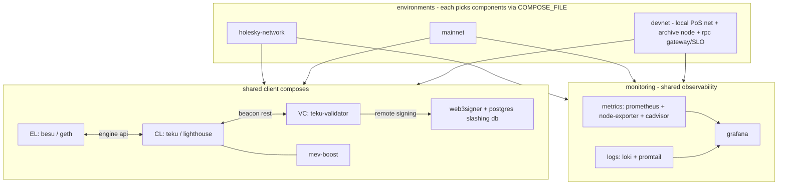

# eth-docker-practice

Docker compose stacks for Ethereum nodes and validators. One directory per
component, deployed independently, joined by a shared bridge network.



## Layout

Client definitions live at the top level and are shared. Each network
directory selects which of them to run (via `COMPOSE_FILE`) and holds that
network's config. Monitoring is a shared stack included by each environment.

**Clients (shared compose):**

| dir | role |
|---|---|
| besu/ | execution client |
| geth/ | execution client |
| teku/ | consensus client |
| lighthouse/ | consensus client |
| teku-validator/ | validator client (signs via web3signer) |
| web3signer/ | remote signer + postgres slashing db |
| mev-boost/ | mev sidecar |

**Environments:**

| dir | what it starts | how |
|---|---|---|
| holesky-network/ | besu + teku + teku-validator + web3signer + monitoring on Holesky | `cd holesky-network && docker compose up -d` |
| mainnet/ | same stack on mainnet | `cd mainnet && docker compose up -d` |
| devnet/ | local PoS net (besu+teku+prysm-vc validating, geth+lighthouse archive) + gateway/SLO + monitoring | `cd devnet && ./scripts/quickstart.sh` |

**Shared:**

| dir | what |
|---|---|
| monitoring/ | full observability, included by each environment: metrics (prometheus + node-exporter + cadvisor), logs (loki + promtail), grafana dashboards (Clients, Devnet, Machine, Containers, Logs) |
| docs/ | day-2 runbook |

Each environment picks its components with `COMPOSE_FILE` in its `.env`, so
the client composes are never duplicated. All images are pinned to current
versions.


## Devnet: local PoS network + archive node (the runnable scenario)

A self-contained local Ethereum PoS network for testing operations against a
chain you fully control - no checkpoint sync, no public testnet, blocks in
seconds. Two client-diverse pairs:

```
validating pair                       archive pair
+------------------+                  +-------------------+
| besu (EL)  :8545 |  <-- EL p2p -->  | geth (EL)  :8547  |
| teku (CL)  :5051 |  <-- CL p2p -->  | lighthouse (CL)   |
| prysm vc, 64 val |                  |  --gcmode=archive |
+------------------+                  +---------+---------+
  produces blocks                               |
                                      gateway (haproxy) :8548
                                      point pool | heavy pool
                                                ^
                                      prober: SLIs -> prometheus

observability (shared): prometheus + node-exporter + cadvisor + loki/promtail
                        -> grafana :3001 (10 dashboards, 19 alerts)
```

The validating pair produces blocks continuously; the archive pair follows
and retains all historical state. Archive queries are served through the
gateway on port 8548 (raw node RPC stays on 8547 for debugging). Client
diversity across the pairs is intentional: a consensus bug in one client
cannot take out both.

Resource note: the full stack is ~18 containers; plan for **8GB RAM and
4+ cores** for the Docker VM.

### Run

One command (macOS / Ubuntu; needs docker with compose v2, curl, python3):

```bash
git clone https://github.com/terrydevops/eth-docker-practice.git
cd eth-docker-practice/devnet
./scripts/quickstart.sh
```

It checks prerequisites, generates identities (local node, or a docker
container if node is not installed), runs the genesis ceremony, starts the
stack, waits for blocks, sends traffic, and runs the full verification
suite. About 5 minutes end to end. `./scripts/quickstart.sh clean` tears
everything down.

The same steps individually, via make:

```bash
make setup     # node identities, jwt secrets, .env (generated, not committed)
make genesis   # one-time genesis ceremony (refuses to rerun)
make up        # start both pairs
make status    # heads of both ELs + consensus slot
make traffic   # send transfers so historical state differs across heights
make verify    # prove the archive property
make test-rpc  # acceptance test of the JSON-RPC surface, through the gateway
make clean     # full reset
```

Blocks start ~90s after genesis.

### Inspect archive queries

`make verify` asserts what makes this an archive node, not a pruned one:

1. archive head follows the validating head
2. `eth_getBalance(account, height)` succeeds at any past height (a pruned
   node returns `missing trie node` beyond its horizon); after `make traffic`
   the balances differ across heights - real point-in-time state
3. `debug_traceBlockByNumber` works on old blocks
4. the geth container runs `--gcmode=archive --state.scheme=hash --syncmode=full --history.transactions=0`

Manual check (funded account balance drops as it spends):

```bash
for b in 0x1 0x58 0x5e; do
  curl -s -X POST -H 'content-type: application/json' \
    -d "{\"jsonrpc\":\"2.0\",\"method\":\"eth_getBalance\",\"params\":[\"0x123463a4B065722E99115D6c222f267d9cABb524\",\"$b\"],\"id\":1}" \
    http://localhost:8547
done
```


### Monitoring

`make up` also starts the shared observability stack. It covers four layers,
so a problem can be traced from the host down to a single log line:

| layer | collector | what |
|---|---|---|
| business (chain) | Prometheus | besu, teku, geth, lighthouse, prysm-validator metrics + archive alerts |
| machine (host) | node-exporter | cpu, memory, disk, filesystem, network of the host |
| container | cAdvisor | per-container cpu / memory / network |
| logs | Loki + Promtail | every container's stdout/stderr, searchable in Grafana |

```bash
make monitor   # print the URLs + a live tip-lag reading
```

- Grafana: http://localhost:3001 (anonymous viewer enabled). Dashboard folders:
  - **Clients** - official per-client dashboards (Besu, Geth, Teku, Lighthouse).
  - **Devnet** - archive dashboard (validating vs archive block height, tip
    lag, CL peers) and validator dashboard (64 validators, attestations,
    proposals).
  - **Machine** - host cpu / memory / disk / network (node-exporter).
  - **Containers** - per-container cpu / memory / network (cAdvisor).
  - **Logs** - log volume, error/warn rate, and a live log viewer with a
    per-service filter and free-text search, backed by Loki.
- Prometheus: http://localhost:9091 - scrapes the five node jobs plus
  node-exporter, cadvisor, the rpc gateway and the prober.
- Loki has no host port: Grafana queries it over the internal network. Promtail
  discovers containers via the docker socket and is scoped (by network) to this
  stack, so it does not ingest unrelated containers on a shared host.

Live views from a running devnet:


*64 validators attesting and proposing; inclusion distance holding at 1.0.*


*Loki: log volume and error/warn rate per service, with a searchable live tail.*

### Archive RPC gateway and SLO

Archive queries are served through a gateway (haproxy, port **8548**), which
is where the SLO is defined and measured - not at the node:

- **Method-class routing**: `debug_`/`trace_` calls are routed to a separate
  pool with a strict concurrency cap, so one pathological trace cannot starve
  point reads. Everything else goes to the point-read pool.
- **Real health checks**: the gateway health check is a JSON-RPC
  `eth_blockNumber` call, not a tcp probe. A node that accepts connections but
  cannot answer is ejected.
- **Synthetic prober**: continuously sends point reads and traces at random
  historical heights through the gateway, and runs two correctness checks
  (cross-client block-hash diff geth vs besu, and the genesis balance
  invariant - which only an archive node can serve).
- **SLO as code** (`monitoring/metrics/prometheus/slo-rules.yml`): recording
  rules compute availability and error-budget burn; alerts follow the
  multi-window multi-burn-rate pattern - fast burn (>14.4x on 5m and 1h)
  pages, slow burn (>6x on 30m and 6h) tickets, p95 breaches ticket, and a
  correctness divergence pages immediately.

The **Devnet - Archive RPC SLO** dashboard shows availability, burn rate,
p95 per method class, correctness status and gateway response codes.

To watch the SLO breach end to end: `docker compose stop geth` - the gateway
returns 503s, availability drops, `RpcAvailabilityFastBurn` fires within
~3 minutes; `docker compose start geth` and it clears.

Alerting follows the same layer split
(`monitoring/metrics/prometheus/alerts.yml`, SLO alerts in `slo-rules.yml`).
severity `page` = wake someone, `ticket` = working hours:

| layer | alerts |
|---|---|
| machine | HostDiskWillFillSoon (projected full <7d, page), HostDiskSpaceLow (page), HostOutOfMemory, HostHighCpu |
| containers | ContainerOomKilled, ContainerMemoryNearLimit (>90% of its limit) |
| chain | ArchiveNodeLagging (page), ArchiveNodeDown (page), NodeDown (page), ChainStalled (page), AttestationsStalling (page), FinalityStalled |
| slo | RpcAvailabilityFastBurn (page), SlowBurn, point/trace p95 breach, RpcCorrectnessDivergence (page) |
| meta | SloMeasurementBlind (prober/gateway down = flying blind), CollectorDown |

Two drills are verified end to end: `docker compose stop geth` fires
ArchiveNodeDown then RpcAvailabilityFastBurn; `docker compose stop
prysm-validator` fires ChainStalled ~2 minutes later (nobody signs
proposals). Both clear on restart.


*The SLO dashboard: availability against the 99.9% objective, error-budget
burn rate, correctness probes, and per-method-class p95 latency.*

### Production archive-node operations

The design for running archive nodes in production (client selection,
capacity, upgrades, backup, monitoring, SLOs) is in
[devnet/docs/archive-node-operations.md](devnet/docs/archive-node-operations.md). This
devnet is the local harness that validates that operational approach.

### Devnet notes

- geth is pinned with `--state.scheme=hash`: recent geth defaults to path
  storage, which does not support archive mode.
- validator client here is prysm, using its built-in interop keys for a
  zero-config devnet. The production validator stack (teku-validator +
  web3signer + slashing db) lives in the component directories at the repo
  root.
- genesis is a one-time ceremony, not part of `make up`: regenerating it on
  restart would silently fork the chain.


## Why this shape

- each component has its own compose project, .env and data dir. EL upgrades
  never touch the VC. components talk over one named bridge network.
- EL and CL both come in two flavours with the same interface, so pairs can
  be mixed: besu+teku primary, geth+lighthouse standby, each synced
  independently.
- validator keys are not on the validator client. web3signer holds them,
  slashing protection lives in postgres. several web3signer instances can
  share one slashing db - db locking makes sure a key signs only once.
- metrics on for every component, http allowlists closed by default.

## Quickstart (holesky)

```bash
# per component: copy env template and review
cd besu && cp .env.example .env && cd ..
cd teku && cp .env.example .env && cd ..

# one jwt secret per EL/CL pair
openssl rand -hex 32 | tr -d "\n" > jwtsecret.hex
cp jwtsecret.hex besu/data/ && cp jwtsecret.hex teku/data/

# EL first, then CL
(cd besu && docker compose up -d)
(cd teku && docker compose up -d)
```

Validator setup and day-2 procedures (deposit keys, voluntary exit,
slashing db migration, api checks): see [docs/runbook.md](docs/runbook.md).

## Notes

- change the placeholder postgres credentials and set your own
  VALIDATORS_FEE_RECIPIENT before starting anything.
- jwt secrets and keystores are gitignored, only templates are committed.
